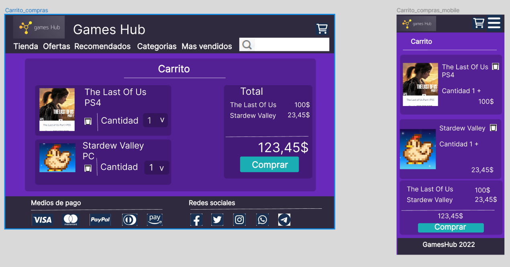
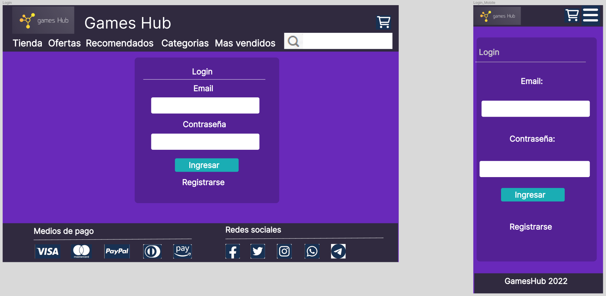

# ***GamesHub***

## Sitio web para compra de videojuegos y consolas de juego

### Audiencia objetivo:

La audiencia objetivo de este sitio web es general con deseo de comprar videojuegos y/o consolas de videojuegos.

### Integrantes del grupo: 

#### ___Nahuel Zelaya:___

Me gusta hacer de todo un poco. Los videojuegos y la cocina me apasionan. Hace poco descubrí este mundo infinito de la programación, y la verdad que la encontré verdaderamente fascinante!!

#### ___Felipe Mendez:___

Estudiante es proceso de profesionalización, 19 años, apasionado por la programación web full stack, especialmente en el backend.

#### ___Gonzalo Potente:___
Estudiante de 4to año de psicología. Hace un tiempo descubrí la programación y ahora decidí meterme a pleno, me interesa en específico el front end. Espero aprender mucho de la mano de mis profesores y compañeros, a la vez que disfrutar el recorrido con ellos. 

#### ___Nicolas Suzuki:___
Me gusta mucho la tecnologia y los videojuegos. Me apasiona la programacion desde hace años pero nunca le dedique el tiempo necesario. Ahora espero poder cumplir mi sueño de ser programador.

#### ___Wilber Leon:___

Analista Sector Funerario, Loco por la tecnologia y estudiante de DH <3

#### ___Gustavo Avella:___

Ingeniero en electronica , amante de la tecnologia y los proyectos de innovacion , entusiasta de las nuevas tendencias tecnologicas.

### Inspiracion en referentes del mercado:

Los sitios con los que nos hemos referenciado para realizar este proyecto son:

- https://dixgamer.com/
- https://estacionplay.com/
- https://www.eneba.com/latam/checkout
- https://store.steampowered.com/?l=spanish
- https://www.gog.com/en/games

### Enlace del diseño:

El diseño preliminar se ha realizado con *Figma* y se puede encontrar en la siguiente URL

https://www.figma.com/file/FaSg1WJLw2FJhlEZvasdAZ/Digital_House?node-id=161%3A238

### Para clonar el repositorio usar:

`git clone https://github.com/gusavella/grupo_6_Games_Hub.git `

### Para actualizar el repositorio local usar:

`git pull https://github.com/gusavella/grupo_6_Games_Hub.git `

### Para actualizar el repositorio remoto usar:

`git push https://github.com/gusavella/grupo_6_Games_Hub.git `

#### Homepage: 

#### Article: 

#### Carrito:
 

 #### Login:
 
